# Class 5: Data Viz with ggplot
Leah Kim A16973745

- [Background](#background)
- [Gene Expression Plot](#gene-expression-plot)
  - [Custom Color Plot](#custom-color-plot)
- [Using Different geoms](#using-different-geoms)
- [File location Online](#file-location-online)
  - [Facetting](#facetting)
- [OPTIONAL CONTENT](#optional-content)
  - [Going Further](#going-further)
  - [Bar Charts](#bar-charts)
  - [Flipping Bar Charts](#flipping-bar-charts)
  - [Extentions: Animation](#extentions-animation)

# Background

There are many graphics systems available in R. These include “base” R
and tones of add on packages like **ggplot2**.

Let’s compare “base” and **ggplot2** briefly. We can use some example
data that is built-in with R called `cars`:

``` r
head(cars)
```

      speed dist
    1     4    2
    2     4   10
    3     7    4
    4     7   22
    5     8   16
    6     9   10

In base R, I can jsut call `plot()`.

``` r
plot(cars)
```


How can we do this with **ggplot2**.

First we need to install the package. We do this
`install.packages("ggplot2")`. I only need to this once and then it will
be availale on my computer from then on.

> Key point: I only install packages in the R console, not within quarto
> docs or R scripts.

Before I use any add-on package, I must load it up with a call to
`library()`.

``` r
#install.packages("ggplot2") ##uncomment to install if needed
library(ggplot2) 
ggplot(cars)
```


Every ggplot has at least 3 things: - The **data** (in our case,
`cars`) - the **aes**thetics (how the data maps to the plot) - the
**geom**s that determine how the plot is drawn (lines, points, columns,
etc)

``` r
ggplot(cars) + 
  aes(x=speed, y = dist)
```


``` r
ggplot(cars) + 
  aes(x=speed, y = dist) +
  geom_point()
```


For “simple” plots, ggplot is much more verbose than base R but the
defaults are nicer and for complicated plots, it becoems much more
efficient and structured.

> Q. Add a line to show the relationship of speed to stopping distance
> (i.e. add another “layer”)

``` r
p <- ggplot(cars) + 
  aes(x=speed, y = dist) +
  geom_point() + 
  geom_smooth(method="lm", se=FALSE)
```

I can always save any ggplot object (i.e. plot) and then use it later
for adding more layers.

``` r
p
```

    `geom_smooth()` using formula = 'y ~ x'


> Q. Add a title and subtitle to the plot

``` r
p + labs(title="My First ggplot",
       subtitle = "Stopping Distances of Old Cars", caption = "BIMM143", x="Speed (MPG)", y = "Stopping distance (ft)") + theme_bw()
```

    `geom_smooth()` using formula = 'y ~ x'

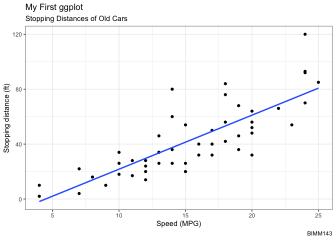

<!-- optional sol adding everything in ggplot at once
ggplot(cars) + 
  aes(x=speed, y=dist) +
  geom_point() +
  labs(title="Speed and Stopping Distances of Cars",
       x="Speed (MPH)", 
       y="Stopping Distance (ft)",
       subtitle = "Your informative subtitle text here",
       caption="Dataset: 'cars'") +
  geom_smooth(method="lm", se=FALSE) +
  theme_bw()
-->

# Gene Expression Plot

Read input data into R

``` r
url <- "https://bioboot.github.io/bimm143_S20/class-material/up_down_expression.txt"
genes <- read.delim(url)
head(genes)
```

            Gene Condition1 Condition2      State
    1      A4GNT -3.6808610 -3.4401355 unchanging
    2       AAAS  4.5479580  4.3864126 unchanging
    3      AASDH  3.7190695  3.4787276 unchanging
    4       AATF  5.0784720  5.0151916 unchanging
    5       AATK  0.4711421  0.5598642 unchanging
    6 AB015752.4 -3.6808610 -3.5921390 unchanging

> Q. How many genes are in this dataset?

``` r
nrow(genes)
```

    [1] 5196

> Q. How many columns are there?

``` r
ncol(genes)
```

    [1] 4

> Q. How many ‘up’ and ‘down’ regulated genes are there?

``` r
table(genes$State)
```


          down unchanging         up 
            72       4997        127 

> Q. Using your values above, what fraction of total genes is
> up-regulated in this dataset?

``` r
round(table(genes$State)/nrow(genes) * 100, 2)
```


          down unchanging         up 
          1.39      96.17       2.44 

## Custom Color Plot

> Q. Make a first plot of this data

``` r
genePlot <- ggplot(genes) + 
  aes(x=Condition1, y=Condition2, col=State) + geom_point() + 
  scale_colour_manual( values=c("blue", "grey", "red")) + 
  labs(title="Gene Expression Changes Upon Drug Treatment", x="Control (no drug)", y ="Drug Treatment") +
  theme_bw()

genePlot
```

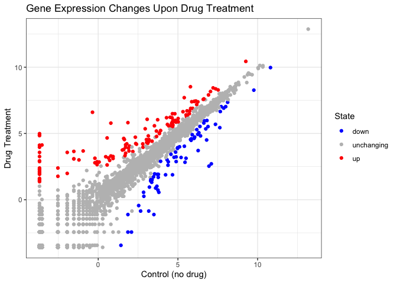

# Using Different geoms

Let’s plot some aspects of the inbuilt `mtcars` dataset.

``` r
head(mtcars)
```

                       mpg cyl disp  hp drat    wt  qsec vs am gear carb
    Mazda RX4         21.0   6  160 110 3.90 2.620 16.46  0  1    4    4
    Mazda RX4 Wag     21.0   6  160 110 3.90 2.875 17.02  0  1    4    4
    Datsun 710        22.8   4  108  93 3.85 2.320 18.61  1  1    4    1
    Hornet 4 Drive    21.4   6  258 110 3.08 3.215 19.44  1  0    3    1
    Hornet Sportabout 18.7   8  360 175 3.15 3.440 17.02  0  0    3    2
    Valiant           18.1   6  225 105 2.76 3.460 20.22  1  0    3    1

> Q. Scatter of `mpg` vs `disp`

``` r
p1 <- ggplot(mtcars) +
  aes(mpg, disp) +
  geom_point()
p1
```


> Q. Boxplot of `gear` vs `disp`

``` r
p2 <- ggplot(mtcars) + 
  aes(gear, disp, group = gear) +
  geom_boxplot()
  p2
```

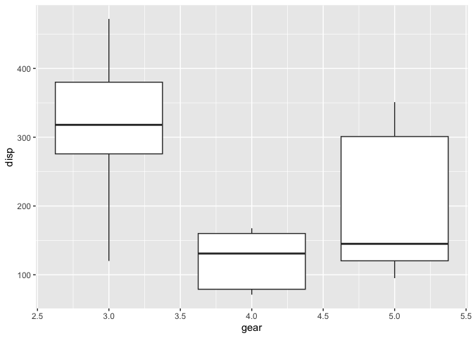

> Q. Barplot of `carb`

``` r
p3 <- ggplot(mtcars) + 
  aes(disp, qsec) +
  geom_smooth()
p3
```

    `geom_smooth()` using method = 'loess' and formula = 'y ~ x'

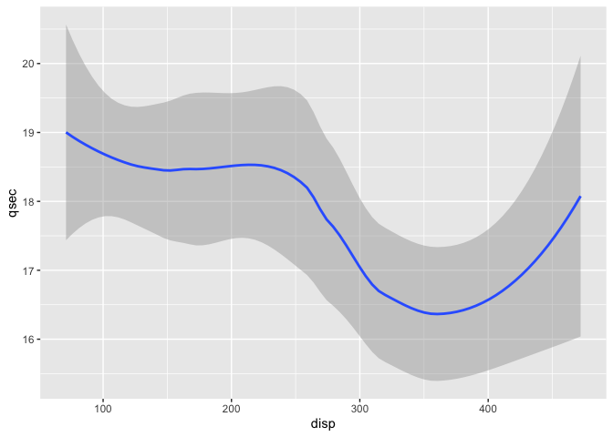

> Q. Smooth of `disp` vs `qsec`

``` r
p4 <- ggplot(mtcars) + 
  aes(carb) +
  geom_bar()
p4
```

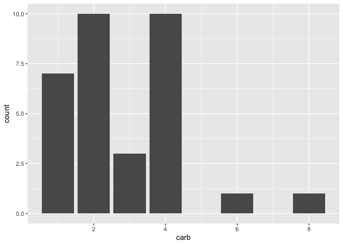

I want to combine all these plots into one figure with multiple pannels.

We can use the **patchwork** package to do this.

``` r
#install.packages('patchwork') 
library(patchwork)
((p1 | p2 | p3) / p4)
```

    `geom_smooth()` using method = 'loess' and formula = 'y ~ x'

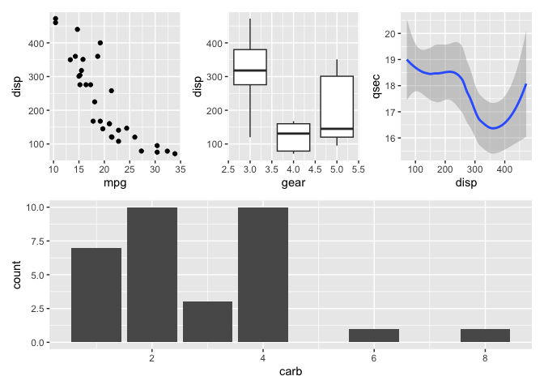

To save a plot as a file:

``` r
#paste under plot that was made, width and height are adjustable
#can also export plot if in viewer
ggsave(filename="myplot.png", width=10, height=10)
```

    `geom_smooth()` using method = 'loess' and formula = 'y ~ x'

# File location Online

``` r
#install.packages("gapminder") 
library(gapminder)
head(gapminder)
```

    # A tibble: 6 × 6
      country     continent  year lifeExp      pop gdpPercap
      <fct>       <fct>     <int>   <dbl>    <int>     <dbl>
    1 Afghanistan Asia       1952    28.8  8425333      779.
    2 Afghanistan Asia       1957    30.3  9240934      821.
    3 Afghanistan Asia       1962    32.0 10267083      853.
    4 Afghanistan Asia       1967    34.0 11537966      836.
    5 Afghanistan Asia       1972    36.1 13079460      740.
    6 Afghanistan Asia       1977    38.4 14880372      786.

> Q. How many countries are in this dataset

``` r
length(table(gapminder$country))
```

    [1] 142

> Q. Plot GDP vs Life Expectency, colored by continent

``` r
ggplot(gapminder) +
  aes(x = gdpPercap, y = lifeExp, col = continent) +
  geom_point()
```


## Facetting

``` r
ggplot(gapminder) +
  aes(x = gdpPercap, y = lifeExp, col = continent) +
  geom_point(alpha = 0.3, show.legend = FALSE) + 
  facet_wrap(~continent) + 
  theme_bw()
```

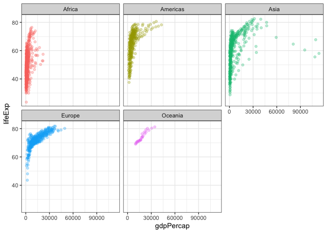

# OPTIONAL CONTENT

## Going Further

> Q. Complete the code below to produce a first basic scatter plot of
> this gapminder_2007 dataset:

``` r
# install.packages("dplyr")
library(dplyr)
```


    Attaching package: 'dplyr'

    The following objects are masked from 'package:stats':

        filter, lag

    The following objects are masked from 'package:base':

        intersect, setdiff, setequal, union

``` r
gapminder_2007 <- gapminder %>% filter(year ==2007)
ggplot(gapminder_2007) + 
  aes(x=gdpPercap, y=lifeExp) + 
  geom_point(alpha=0.5)
```

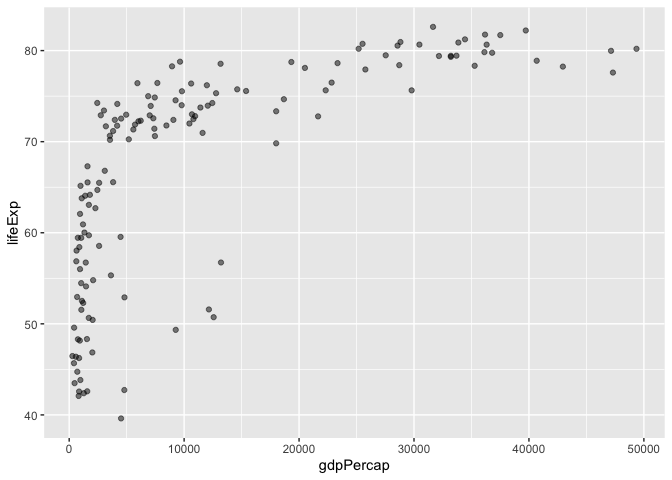

> Customized plot

``` r
gapminder_2007 <- gapminder %>% filter(year ==2007)
gap_2007 <- ggplot(gapminder_2007) + 
  aes(x=gdpPercap, y=lifeExp, color=continent, size=pop) + 
  geom_point(alpha=0.5) + 
  scale_size_area(max_size = 10)

gap_2007
```

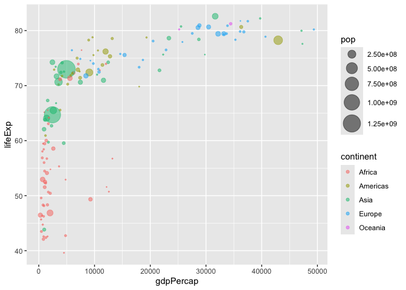

> Q. Can you adapt the code you have learned thus far to reproduce our
> gapminder scatter plot for the year 1957?

``` r
gapminder_1957 <- gapminder %>% filter(year == 1957)
gap_1957 <- ggplot(gapminder_1957) + 
  aes(x = gdpPercap, y = lifeExp, color = continent, size = pop) + 
  geom_point(alpha = 0.7) + 
  scale_size_area(max_size = 10)

gap_1957
```

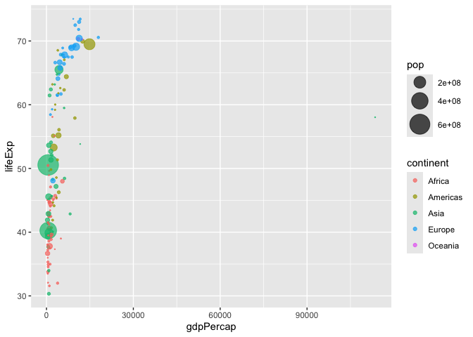

> Q. Do the same steps above but include 1957 and 2007 in your input
> dataset for ggplot(). You should now include the layer
> facet_wrap(~year) to produce the following plot:

``` r
gapminder_compare <- gapminder %>% filter(year == 1957 | year == 2007)
gap_compare <- ggplot(gapminder_compare) + 
  aes(x = gdpPercap, y = lifeExp, color = continent, size = pop) + 
  geom_point(alpha = 0.7) + 
  scale_size_area(max_size = 10) +
  facet_wrap(~year)

gap_compare
```

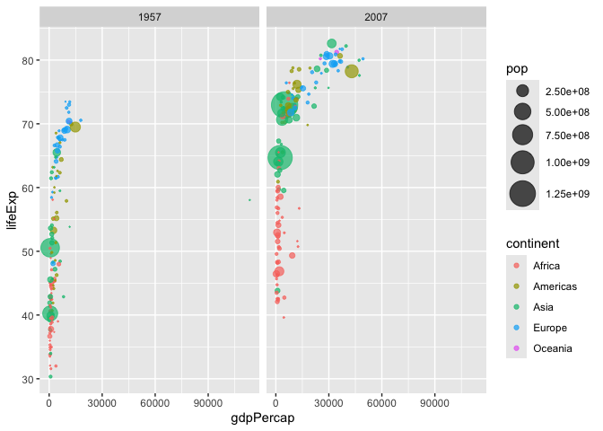

## Bar Charts

> Creating a simple bar chart

``` r
gapminder_top5 <- gapminder %>% 
  filter(year==2007) %>% 
  arrange(desc(pop)) %>% 
  top_n(5, pop)

gapminder_top5
```

    # A tibble: 5 × 6
      country       continent  year lifeExp        pop gdpPercap
      <fct>         <fct>     <int>   <dbl>      <int>     <dbl>
    1 China         Asia       2007    73.0 1318683096     4959.
    2 India         Asia       2007    64.7 1110396331     2452.
    3 United States Americas   2007    78.2  301139947    42952.
    4 Indonesia     Asia       2007    70.6  223547000     3541.
    5 Brazil        Americas   2007    72.4  190010647     9066.

> Create a bar chart showing the life expectancy of the five biggest
> countries by population in 2007

``` r
ggplot(gapminder_top5) + 
  geom_col(aes(x = country, y = lifeExp))
```

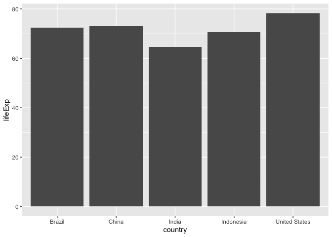

> Coloring barcharts

``` r
ggplot(gapminder_top5) + 
  geom_col(aes(x = country, y = pop, fill = continent))
```

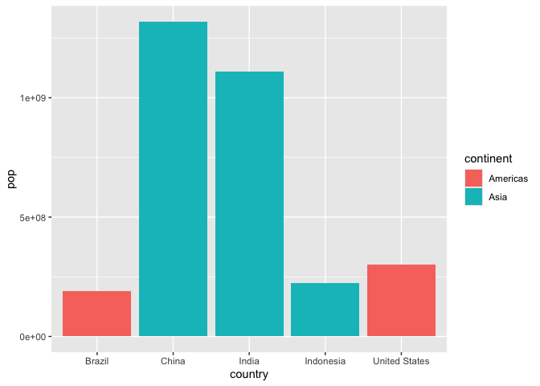

``` r
ggplot(gapminder_top5) + 
  geom_col(aes(x = country, y = pop, fill = lifeExp))
```

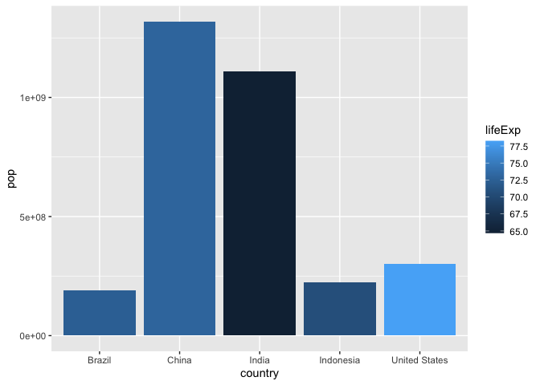

> Plot Population size by country. Create a bar chart showing the
> population (in millions) of the five biggest countries by population
> in 2007.

``` r
ggplot(gapminder_top5) +
  aes(x = reorder(country, -pop), y = pop, fill = country) +
  geom_col(col = "gray30") +
  guides(fill = "none")
```

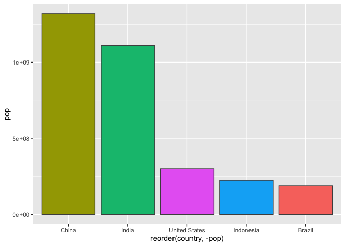

## Flipping Bar Charts

> First plot

``` r
head(USArrests)
```

               Murder Assault UrbanPop Rape
    Alabama      13.2     236       58 21.2
    Alaska       10.0     263       48 44.5
    Arizona       8.1     294       80 31.0
    Arkansas      8.8     190       50 19.5
    California    9.0     276       91 40.6
    Colorado      7.9     204       78 38.7

``` r
USArrests$State <- rownames(USArrests)
ggplot(USArrests) + aes(x=reorder(State, Murder), y = Murder) +
  geom_col() +
  coord_flip()
```

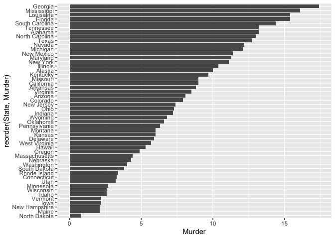

> Custom Plot

``` r
ggplot(USArrests) +
  aes(x = reorder(State, Murder), y = Murder) +
  geom_point() +
  geom_segment(aes(x = State, 
                   xend = State, 
                   y = 0, 
                   yend = Murder), color = "blue") +
  coord_flip()
```

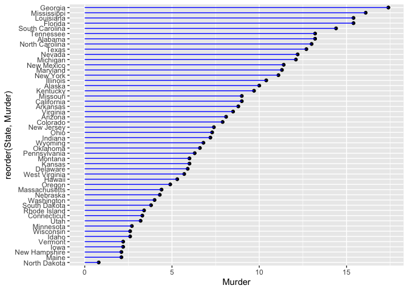

## Extentions: Animation

``` r
#install.packages("gganimate")
library(gganimate)

# Setup nice regular ggplot of the gapminder data
ggplot(gapminder, aes(gdpPercap, lifeExp, size = pop, colour = country)) +
  geom_point(alpha = 0.7, show.legend = FALSE) +
  scale_colour_manual(values = country_colors) +
  scale_size(range = c(2, 12)) +
  scale_x_log10() +
  # Facet by continent
  facet_wrap(~continent) +
  # Here comes the gganimate specific bits
  labs(title = 'Year: {frame_time}', x = 'GDP per capita', y = 'life expectancy') +
  transition_time(year) +
  shadow_wake(wake_length = 0.1, alpha = FALSE)
```

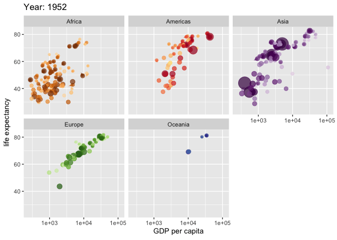
