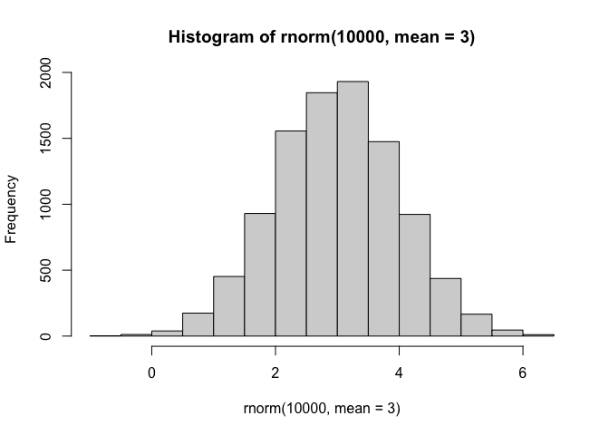
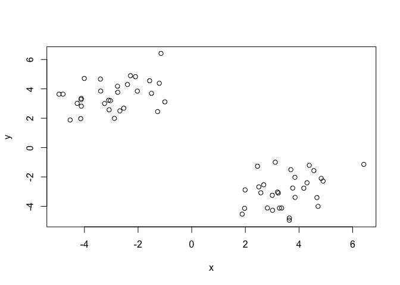
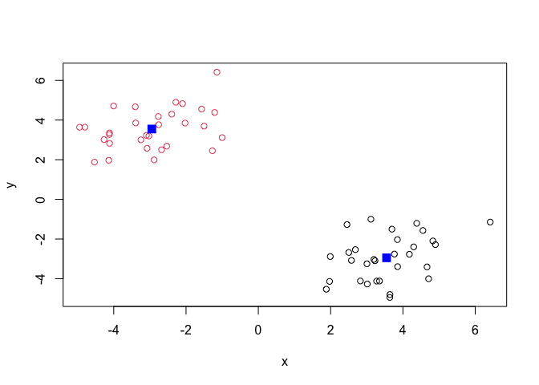
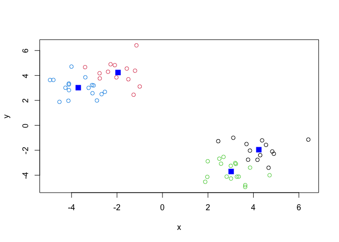
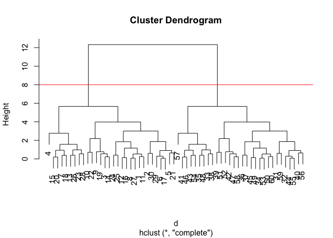
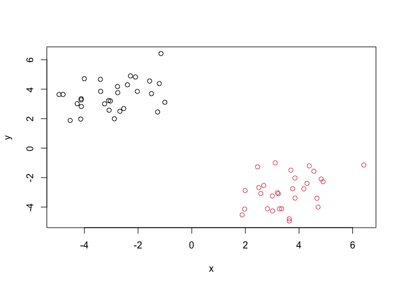
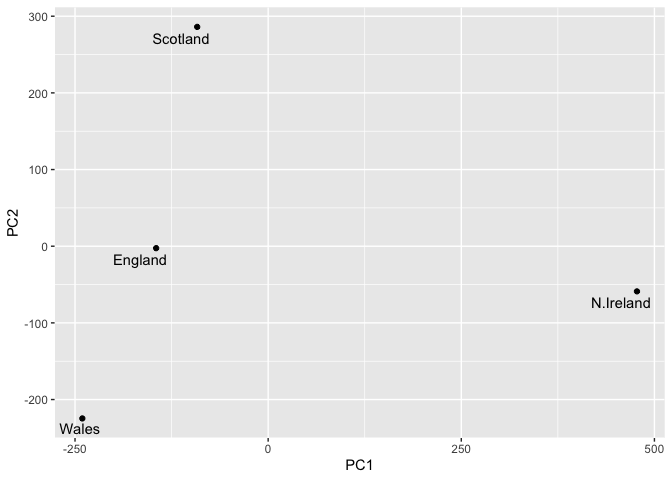

# Class 7: Machine Learning
Leah Kim A16973745

- [Clustering](#clustering)
- [K-means](#k-means)
  - [Hierarchical Clustering](#hierarchical-clustering)
- [Principal Component Analysis
  (PCA)](#principal-component-analysis-pca)
  - [Data import](#data-import)
  - [PCA to the Rescue](#pca-to-the-rescue)

Today we will explore unsupervised machine learning methods starting
with clustering and dimensionality reduction.

## Clustering

To start let’s make up some data to cluster where we know what the
answer should be.

``` r
hist(rnorm(10000, mean = 3))
```



Return a vector with 30 numbers centered on -3 and 30 centered on +3.

``` r
tmp <- c(rnorm(30, mean = -3), rnorm(30, mean = 3))
x <- cbind(x = tmp, y = rev(tmp))
```

Make a plot of `x`.

``` r
plot(x)
```



## K-means

The main function in “base” R for K-means clustering is called
`kmeans()`.

``` r
km <- kmeans(x, centers = 2)
km
```

    K-means clustering with 2 clusters of sizes 30, 30

    Cluster means:
              x         y
    1  3.547684 -2.946689
    2 -2.946689  3.547684

    Clustering vector:
     [1] 2 2 2 2 2 2 2 2 2 2 2 2 2 2 2 2 2 2 2 2 2 2 2 2 2 2 2 2 2 2 1 1 1 1 1 1 1 1
    [39] 1 1 1 1 1 1 1 1 1 1 1 1 1 1 1 1 1 1 1 1 1 1

    Within cluster sum of squares by cluster:
    [1] 68.89497 68.89497
     (between_SS / total_SS =  90.2 %)

    Available components:

    [1] "cluster"      "centers"      "totss"        "withinss"     "tot.withinss"
    [6] "betweenss"    "size"         "iter"         "ifault"      

The `kmeans()` function returns a “list” with 9 components. You can see
the named components of any list with the `attributes()` function.

``` r
attributes(km)
```

    $names
    [1] "cluster"      "centers"      "totss"        "withinss"     "tot.withinss"
    [6] "betweenss"    "size"         "iter"         "ifault"      

    $class
    [1] "kmeans"

> Q. How many points are in each cluster.

``` r
km$size
```

    [1] 30 30

> Q. Cluster assignment/membership vector?

``` r
km$cluster
```

     [1] 2 2 2 2 2 2 2 2 2 2 2 2 2 2 2 2 2 2 2 2 2 2 2 2 2 2 2 2 2 2 1 1 1 1 1 1 1 1
    [39] 1 1 1 1 1 1 1 1 1 1 1 1 1 1 1 1 1 1 1 1 1 1

> Q. Cluster centers

``` r
km$centers
```

              x         y
    1  3.547684 -2.946689
    2 -2.946689  3.547684

> Q. Make a plot of our `kmeans()` results showing cluster assignment
> using different colors for each cluster/group of points and cluster
> centers

``` r
plot(x, col = km$cluster)
points(km$centers, col = "blue", pch=15, cex=1.5)
```



> Q. Run `kmeans()` again on `x` adn this cluster into four
> groups/clusters and plot the same result figure as above.

``` r
km2 <- kmeans(x, centers = 4)
plot(x, col = km2$cluster)
points(km2$centers, col = "blue", pch=15, cex=1.5)
```



> **Key point**: K0means clustering is super populr but can be misused.
> One big limitation is that it can impose a clustering pattern on your
> data even if clear natural grouping doesn’t exist - i.e. it does what
> you tell it to do in terms of `centers`.

### Hierarchical Clustering

The main function in “base” R for hierarchical clsutering is called
`hclust()`.

You cannot just pas our dataset as is into `hclust()`. You must give a
“distance matrix” as an input. We can ge tthis from the `dist()`
function.

``` r
d <- dist(x)
hc <- hclust(d, method = "complete")
```

Hclust cannot use have a special `plot()` method

``` r
plot(hc)
abline(h=8, col="red")
```



To get our main cluster assignment (membership vector), we need to cut
the tree at the goal posts with `cutree()`.

``` r
grps <- cutree(hc, h=8)
grps
```

     [1] 1 1 1 1 1 1 1 1 1 1 1 1 1 1 1 1 1 1 1 1 1 1 1 1 1 1 1 1 1 1 2 2 2 2 2 2 2 2
    [39] 2 2 2 2 2 2 2 2 2 2 2 2 2 2 2 2 2 2 2 2 2 2

``` r
table(grps)
```

    grps
     1  2 
    30 30 

``` r
plot(x, col = grps)
```



Hierchical clustering is distinct in that the dendrogram (tree figure)
can reveal the potential grouping in your data (unlke K-means).

## Principal Component Analysis (PCA)

PCA is a common and highly useful dimensionality reduction technique
used in many field - particularly bioinformatics.

Here we will analyze some data from the UK on food consumption.

### Data import

``` r
url <- "https://tinyurl.com/UK-foods"
x <- read.csv(url)

head(x)
```

                   X England Wales Scotland N.Ireland
    1         Cheese     105   103      103        66
    2  Carcass_meat      245   227      242       267
    3    Other_meat      685   803      750       586
    4           Fish     147   160      122        93
    5 Fats_and_oils      193   235      184       209
    6         Sugars     156   175      147       139

``` r
#will gradually remove columns when run over and over again until there are no columns in the table
rownames(x) <- x[,1]
x <- x[,-1]
head(x)
```

                   England Wales Scotland N.Ireland
    Cheese             105   103      103        66
    Carcass_meat       245   227      242       267
    Other_meat         685   803      750       586
    Fish               147   160      122        93
    Fats_and_oils      193   235      184       209
    Sugars             156   175      147       139

``` r
#fixes the above issue by reading the input differently
x <- read.csv(url, row.names = 1)
head(x)
```

                   England Wales Scotland N.Ireland
    Cheese             105   103      103        66
    Carcass_meat       245   227      242       267
    Other_meat         685   803      750       586
    Fish               147   160      122        93
    Fats_and_oils      193   235      184       209
    Sugars             156   175      147       139

``` r
barplot(as.matrix(x), beside=T, col=rainbow(nrow(x)))
```


``` r
barplot(as.matrix(x), beside=F, col=rainbow(nrow(x)))
```


One conventional plot that can be useful is called a “pairs” plot.

``` r
pairs(x, col=rainbow(nrow(x)), pch=16)
```


### PCA to the Rescue

The main function in bse R for PCA is called `prcomp()`.

``` r
#transpose of x, x and y axis flipped
t(x)
```

              Cheese Carcass_meat  Other_meat  Fish Fats_and_oils  Sugars
    England      105           245         685  147            193    156
    Wales        103           227         803  160            235    175
    Scotland     103           242         750  122            184    147
    N.Ireland     66           267         586   93            209    139
              Fresh_potatoes  Fresh_Veg  Other_Veg  Processed_potatoes 
    England               720        253        488                 198
    Wales                 874        265        570                 203
    Scotland              566        171        418                 220
    N.Ireland            1033        143        355                 187
              Processed_Veg  Fresh_fruit  Cereals  Beverages Soft_drinks 
    England              360         1102     1472        57         1374
    Wales                365         1137     1582        73         1256
    Scotland             337          957     1462        53         1572
    N.Ireland            334          674     1494        47         1506
              Alcoholic_drinks  Confectionery 
    England                 375             54
    Wales                   475             64
    Scotland                458             62
    N.Ireland               135             41

``` r
pca <- prcomp(t(x))
summary(pca)
```

    Importance of components:
                                PC1      PC2      PC3       PC4
    Standard deviation     324.1502 212.7478 73.87622 3.176e-14
    Proportion of Variance   0.6744   0.2905  0.03503 0.000e+00
    Cumulative Proportion    0.6744   0.9650  1.00000 1.000e+00

The `prcomp()` funciton returns a list object of our results.

``` r
attributes(pca)
```

    $names
    [1] "sdev"     "rotation" "center"   "scale"    "x"       

    $class
    [1] "prcomp"

The two main “results” from here are `pca$x` and `pca%rotation`. The
first of these (`pca$x`) contains the scores of the data on the new PC
axis - we use these to make our PCA plot.

``` r
pca$x
```

                     PC1         PC2        PC3           PC4
    England   -144.99315   -2.532999 105.768945 -4.894696e-14
    Wales     -240.52915 -224.646925 -56.475555  5.700024e-13
    Scotland   -91.86934  286.081786 -44.415495 -7.460785e-13
    N.Ireland  477.39164  -58.901862  -4.877895  2.321303e-13

``` r
library(ggplot2)
library(ggrepel)
# Make a plot of pca$x with PC1 vs PC2

ggplot(pca$x) + 
  aes(PC1, PC2, label = rownames(pca$x)) +
  geom_point() +
  geom_text_repel()
```



This figure shows the PC values of each nation in the PC1 and PC2 axes
The distance between the points on this axis represents how similar they
are to each other. For this data, on the PC1 axis, all the nations in
Great Britain are grouped together and North Ireland is separate,
indicating North Ireland is noticeably different.

The second major result is contained within the `pca$rotation` object or
component. Let’s plot thsi to see what PCa is picking up…

``` r
ggplot(pca$rotation) + 
  aes(PC1, rownames(pca$rotation)) + 
  geom_col()
```


This figure shows how strongly the variables / dimensions contributed
the most to the calculation of PCA1 and in what way, with longer columns
signifying a higher contribution. For this data, the further to the
right the column leads, the more that specific food is consumed in North
Ireland compared to the other nations, and the further left the column
leads, the more that specific food is consumed in Great Britain.
