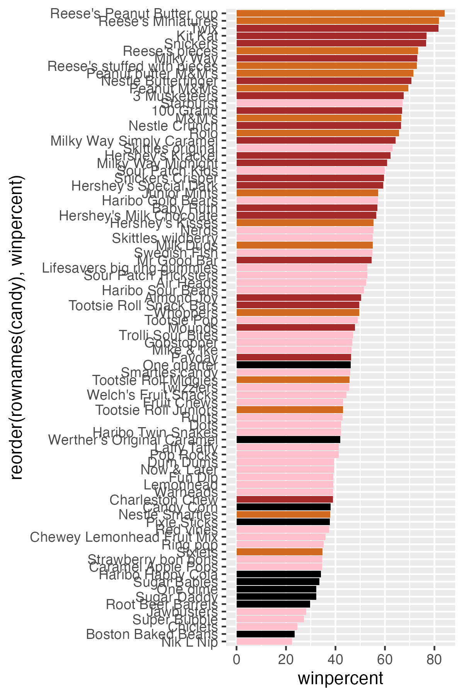

Today we will take a wee step back to some data we can taste and explore the correlation structure and principal compoents of some Halloween candy.

## 1. Importing data

```{r}
candy_file <- "candy-data.csv" 
candy = read.csv(candy_file, row.names=1)
head(candy)
```
> Q1. How many different candy types are in this dataset?

```{r}
nrow(candy)
```

> Q2. How many fruity candy types are in the dataset?

```{r}
sum(candy$fruity == "1")
```

## 2. What is your favorite candy

> Q3. What is your favorite candy in the dataset and what is it’s winpercent value?

```{r}
candy["Swedish Fish", ]$winpercent
```

> Q4. What is the winpercent value for “Kit Kat”?

```{r}
candy["Kit Kat", ]$winpercent
```

> Q5. What is the winpercent value for “Tootsie Roll Snack Bars”?

```{r}
candy["Tootsie Roll Snack Bars", ]$winpercent
```
## Exploratory Analysis

We can use the **skimr** package to get a quick overview of a given dataset. This can be useful for the first time you encounter a new dataset.
```{r}
library("skimr")
skim(candy)
```

> Q6. Is there any variable/column that looks to be on a different scale to the majority of the other columns in the dataset?

It looks like the last column `candy$winpercent` is on a different scale to all others. Looking at the mean, sd, and p values, it seems to be on a scale of 0-100 instead of 0-1.

> Q7. What do you think a zero and one represent for the candy$chocolate column?

It's a true or false statement; if a candy has chocolate, it's value would have 1, otherwise it would have 0.

> Q8. Plot a histogram of winpercent values

```{r}
hist(candy$winpercent)
```
```{r}
library(ggplot2)

ggplot(candy) + 
  aes(winpercent) +
  geom_histogram(bins=10, fill="blue")
```

> Q9. Is the distribution of winpercent values symmetrical?

No, skewed left.

> Q10. Is the center of the distribution above or below 50%?

```{r}
summary(candy$winpercent)
```

Median is below 50%, mean is on 50%.

> Q11. On average is chocolate candy higher or lower ranked than fruit candy?

```{r}
choc.inds <- candy$chocolate == 1
choc.candy <- candy[choc.inds,]
choc.win <-choc.candy$winpercent
mean(choc.win)

fruit.win <- candy[as.logical(candy$fruity),]$winpercent
mean(fruit.win)
```

higher

> Q12. Is this difference statistically significant?

```{r}
ans <- t.test(choc.win, fruit.win)
```
Yes, with a p value of `r ans$p.value` the difference is statistically significant.

## 3. Overall Candy Rankings 

> Q13. What are the five least liked candy types in this set?

There are two related function that can help here, one is the classic `sort()` and `order()` .

```{r}
x <- c(5, 10, 1, 4)
sort(x)
```

```{r}
inds <- order(candy$winpercent)
head(candy[inds,], 5)
```

> Q14. What are the top 5 all time favorite candy types out of this set?

```{r}
tail(candy[inds,], 5)
```

or 

```{r}
inds <- order(candy$winpercent, decreasing = T)
head(candy[inds,], 5)
```

> Q15. Make a first barplot of candy ranking based on winpercent values

```{r}
ggplot(candy) + 
  aes(winpercent, rownames(candy)) +
  geom_col()
```
> Q16. This is quite ugly, use the reorder() function to get the bars sorted by winpercent?

```{r}
ggplot(candy) + 
  aes(winpercent, reorder(rownames(candy),winpercent)) +
  geom_col()
```

Here we want a custom color vector to color each bar the way we want = with chocolate and fruity candy together with whether it is a bar or not.

```{r}
my_cols=rep("black", nrow(candy))
my_cols[as.logical(candy$chocolate)] = "chocolate"
my_cols[as.logical(candy$fruity)] = "pink"
my_cols[as.logical(candy$bar)] = "brown"

ggplot(candy) + 
  aes(winpercent, reorder(rownames(candy),winpercent)) +
  geom_col(fill=my_cols) 

ggsave("mybarplot.png", width = 4, height = 6)
```


> Q17. What is the worst ranked chocolate candy?

Sixlets

> Q18. What is the best ranked fruity candy?

Starburst

## 4. Taking a look at pricepercent

```{r}
library(ggrepel)
#pink is too light, lets change the colors
my_cols=rep("black", nrow(candy))
my_cols[as.logical(candy$chocolate)] = "chocolate"
my_cols[as.logical(candy$bar)] = "brown"
my_cols[as.logical(candy$fruity)] = "red"
# How about a plot of price vs win
ggplot(candy) +
  aes(winpercent, pricepercent, label=rownames(candy)) +
  geom_point(col=my_cols) + 
  geom_text_repel(col=my_cols, size=3.3, max.overlaps = 5)
```

> Q19. Which candy type is the highest ranked in terms of winpercent for the least money - i.e. offers the most bang for your buck?

Reeses Minatures seem to be the highest ranked in terms of win percent for the least money.

> Q20. What are the top 5 most expensive candy types in the dataset and of these which is the least popular?

```{r}
ord <- order(candy$pricepercent, decreasing = TRUE)
head( candy[ord,c(11,12)], n=5 )
```
Nik L Nip is the least popular of the toop 5 most expensive candy types.

## 5. Correlation Structure

```{r}
library(corrplot)
cij <- cor(candy)
cij
```

```{r}
corrplot(cij)
```


> Q22. Examining this plot what two variables are anti-correlated (i.e. have minus values)?

```{r}
round(cij["chocolate", "fruity"], 2)
round(cij["pluribus", "bar"], 2)
```


Chocolate and fruity are anti-correlated, along with pluribus and bar.

> Q23. Similarly, what two variables are most positively correlated?

Chocolate and bar, along with chocolate and winpercent seem to be positively correlated.

```{r}
round(cij["chocolate", "bar"], 2)
round(cij["chocolate", "winpercent"], 2)
```

## 6. Principal Component Analysis

We need to be sure to scale our input `candy` data before PCA as we have the `winpercent` column on a different scale to all others in the dataset. 

```{r}
pca <- prcomp(candy, scale = TRUE)
summary(pca)
```
First main result figure is my "PCA plot"
```{r}
#pca$x
ggplot(pca$x) +
  aes(PC1, PC2, label = rownames(pca$x)) +
  geom_point(col = my_cols) + 
  geom_text_repel(max.overlaps = 6, col = my_cols) + 
  theme_bw() + 
  labs(title="Halloween Candy PCA Space",
       subtitle="Colored by type: chocolate bar (dark brown), chocolate other (light brown), fruity (red), other (black)",
       caption="Data from 538")
```

The second main PCA result is in the `pca$rotation`. We can plot this to generate a so-called "loadings" plot.
```{r}
#pca$rotation

ggplot(pca$rotation) + 
  aes(PC1, rownames(pca$rotation)) + 
  geom_col()
```
```{r}
ggplot(pca$rotation) + 
  aes(PC1, reorder(rownames(pca$rotation), PC1), fill = PC1) + 
  geom_col()
```
> Q24. What original variables are picked up strongly by PC1 in the positive direction? Do these make sense to you?

The variables that are positive in PC1 are fruity, hard, and pluribus. This makes sense as it picks up on the correlations established earlier (such as how fruity candy tend to be hard and pluribus).