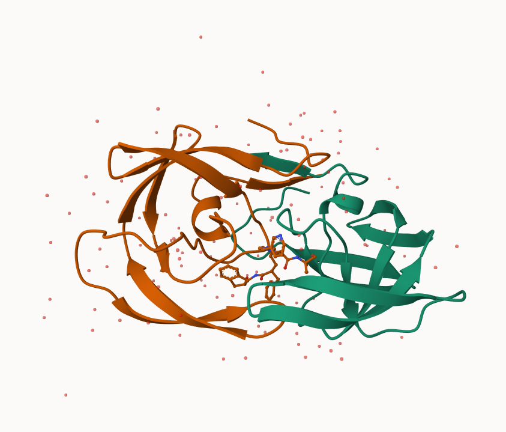
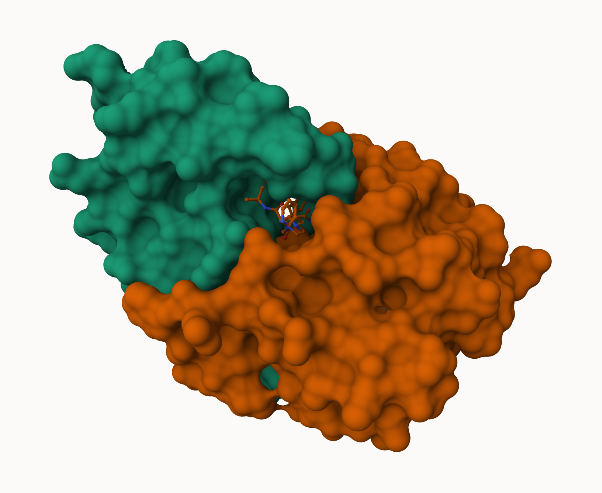
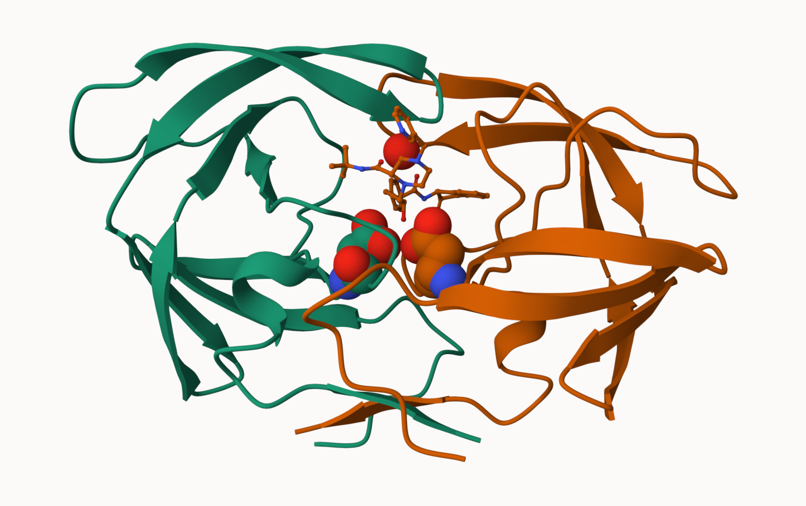

## 1. PBB Statistics

The main repository of biomolecular structure data is called the [Protein Data Bank](https://www.rcsb.org/) (PDB for short). It is the second oldest database (after GenBank).

What is currently in the PDB? We can access current composition stats [here](https://www.rcsb.org/stats/)

```{r}
stats <- read.csv("Data Export Summary.csv")
stats
```

> Q1: What percentage of structures in the PDB are solved by X-Ray and Electron Microscopy.

```{r}
#substitute commas for nothing and convert to numeric
xray.num <- as.numeric(gsub(",", "", stats$X.ray))

#sum the result
sum(xray.num)
```
Turn this snippet into a function so I can use it any time I have this comma problem. 

```{r}
comma.sum <- function(x) {
  y <- sum(as.numeric(gsub(",", "", x)))
  return(y)
}
```

```{r}
xray.sum <- comma.sum(stats$X.ray)
em.sum <- comma.sum(stats$EM)
total.sum <- comma.sum(stats$Total)

xray.sum/total.sum * 100
em.sum/total.sum * 100
```


> Q2: What proportion of structures in the PDB are protein?

```{r}
#includes Oligosaccharides and NA values
total.num <- as.numeric(gsub(",", "", stats$Total))
sum(total.num[1:3])/total.sum
```

> Q3: Type HIV in the PDB website search box on the home page and determine how many HIV-1 protease structures are in the current PDB?

SKIPPED

## 2. Visualizing with Mol-star

Explore the HIV-1 protease structure with PDB code: `1HSG` using [Molstar](https://molstar.org/viewer/)






## 3. Using the2 Bio3D in R

The bio3d package is used for bioinformatics analysis and allows us to read and analyze PDB (and related) data.
```{r}
library(bio3d)
``` 
```{r}
pdb <- read.pdb("1hsg")
pdb
```

```{r}
head(pdb$atom)
```

> Q7: How many amino acid residues are there in this pdb object? 

198

> Q8: Name one of the two non-protein residues? 

HOH

> Q9: How many protein chains are in this structure? 

2

```{r}
library(bio3dview)
library(NGLVieweR)

#view.pdb(pdb, backgroundColor = "pink", colorScheme = "sse") |>
  #setSpin()
```

```{r}
# Select the important ASP 25 residue
sele <- atom.select(pdb, resno=25)

# and highlight them in spacefill representation
#view.pdb(pdb, cols=c("green","orange"), highlight = sele, highlight.style = "spacefill") |>
  #setRock()
```

### Predicting funcitonal motions of a single structure

We can finish off today with a bioinformatics prediction of the functional motions of a protein.

We will run a Normal mode Analysis (NMA)
```{r}
adk <- read.pdb("6s36")
adk
```

```{r}
m <- nma(adk)
plot(m)
```

```{r}
mktrj(m, file="adk_m7.pdb")
#view.nma(m, pdb=adk)
```


## 4. Comparative Structure Analysis of Adenylate Kinase
### Search and receive ADK stuctures

```{r}
library(bio3d)
```

We will analyze the ADK starting with a singe ADK database accession code: "1ake_A". 

```{r}
ID <- "1ake_A"
aa <- get.seq(ID)
aa
```

Now we can search the PDB databse to find all related enteries.

```{r}
# Blast or hmmer search 
b <- blast.pdb(aa)
```

Make a little summary figure of these results.

```{r}
# Plot a summary of search results
hits <- plot(b)

#if blast doesn't return results
#hits <- NULL
#hits$pdb.id <- c('1AKE_A','6S36_A','6RZE_A','3HPR_A','1E4V_A','5EJE_A','1E4Y_A','3X2S_A','6HAP_A','6HAM_A','4K46_A','3GMT_A','4PZL_A')
```

Our "top hits" i.e. the most smilar enteries in the database are:

```{r}
hits$pdb.id
```

```{r}
# Download releated PDB files
files <- get.pdb(hits$pdb.id, path="pdbs", split=TRUE, gzip=TRUE)
```


### Align and superpose structures

```{r}
# Align releated PDBs
pdbs <- pdbaln(files, fit = TRUE, exefile="msa")
```
Side Note:
```{r}
library(bio3dview)

view.pdbs(pdbs)
```

```{r}
# Vector containing PDB codes for figure axis
ids <- basename.pdb(pdbs$id)

# Draw schematic alignment
plot(pdbs, labels=ids)
```
This is better but still difficult to see what is similar and different in all these structures or indeed learn much about how this family works.


## Viewing supeposed structures
```{r}
anno <- pdb.annotate(ids)
unique(anno$source)
anno
```

Lets try PCA:
```{r}
pc <- pca(pdbs)
plot(pc)
```

```{r}
rd <- rmsd(pdbs)

# Structure-based clustering
hc.rd <- hclust(dist(rd))
grps.rd <- cutree(hc.rd, k=3)

plot(pc, 1:2, col="grey50", bg=grps.rd, pch=21, cex=1)
```

```{r}
view.pca(pc)
```


Write a PDB Trajectory for mol-star
```{r}
mktrj(pc, file = "pca_results.pdb")
```

