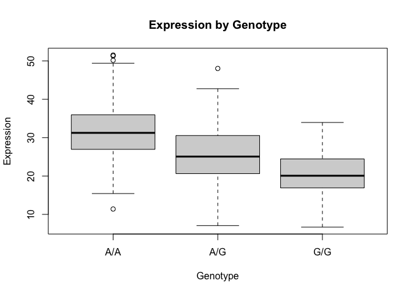

# Class 12
Leah Kim A16973745

- [Class 12 Homework](#class-12-homework)
  - [Q13: Read this file into R and determine the sample size for each
    genotype and their corresponding median expression levels for each
    of these genotypes. Hint: The read.table(), summary() and boxplot()
    functions will likely be useful here. There is an example R script
    online to be used ONLY if you are struggling in vein. Note that you
    can find the medium value from saving the output of the boxplot()
    function to an R object and examining this object. There is also the
    medium() and summary() function that you can use to check your
    understanding.](#q13-read-this-file-into-r-and-determine-the-sample-size-for-each-genotype-and-their-corresponding-median-expression-levels-for-each-of-these-genotypes-hint-the-readtable-summary-and-boxplot-functions-will-likely-be-useful-here-there-is-an-example-r-script-online-to-be-used-only-if-you-are-struggling-in-vein-note-that-you-can-find-the-medium-value-from-saving-the-output-of-the-boxplot-function-to-an-r-object-and-examining-this-object-there-is-also-the-medium-and-summary-function-that-you-can-use-to-check-your-understanding)
  - [Q14: Generate a boxplot with a box per genotype, what could you
    infer from the relative expression value between A/A and G/G
    displayed in this plot? Does the SNP effect the expression of
    ORMDL3? Hint: An example boxplot is provided overleaf – yours does
    not need to be as polished as this
    one.](#q14-generate-a-boxplot-with-a-box-per-genotype-what-could-you-infer-from-the-relative-expression-value-between-aa-and-gg-displayed-in-this-plot-does-the-snp-effect-the-expression-of-ormdl3-hint-an-example-boxplot-is-provided-overleaf--yours-does-not-need-to-be-as-polished-as-this-one)

# Class 12 Homework

## Q13: Read this file into R and determine the sample size for each genotype and their corresponding median expression levels for each of these genotypes. Hint: The read.table(), summary() and boxplot() functions will likely be useful here. There is an example R script online to be used ONLY if you are struggling in vein. Note that you can find the medium value from saving the output of the boxplot() function to an R object and examining this object. There is also the medium() and summary() function that you can use to check your understanding.

Reading the dataset

``` r
data <- read.table("rs8067378_ENSG00000172057.6.txt", header = TRUE, sep = "", stringsAsFactors = TRUE)
names(data)
```

    [1] "sample" "geno"   "exp"   

Sample Size for each genotype:

``` r
table(data$geno)
```


    A/A A/G G/G 
    108 233 121 

## Q14: Generate a boxplot with a box per genotype, what could you infer from the relative expression value between A/A and G/G displayed in this plot? Does the SNP effect the expression of ORMDL3? Hint: An example boxplot is provided overleaf – yours does not need to be as polished as this one.

Boxplot for each genotype:

``` r
bp <- boxplot(exp ~ geno, data = data, 
              main = "Expression by Genotype",  
              xlab = "Genotype", 
              ylab = "Expression")
```



``` r
bp$stats[3, ]
```

    [1] 31.24847 25.06486 20.07363

Median expression of each genotype:

``` r
bp$stats[3, ]
```

    [1] 31.24847 25.06486 20.07363

As shown by the boxplot, the A/A genotype has the highet median
expression of around 30, the A/G has the middle expression of around 25,
and G/G has the lowest median expression of around 20. Though there is a
bit of overlap, there is a consistent decline in expression the more G
alleles the genotype has.

This suggests that the SNPS does affect the expression of ORMDL_3 with
the presense of the G allele reducing expression. Individuals with G/G
genotype consistently show lower expression, while those with A/A show
the highest.

Summary of data:

``` r
summary(data)
```

         sample     geno          exp        
     HG00096:  1   A/A:108   Min.   : 6.675  
     HG00097:  1   A/G:233   1st Qu.:20.004  
     HG00099:  1   G/G:121   Median :25.116  
     HG00100:  1             Mean   :25.640  
     HG00101:  1             3rd Qu.:30.779  
     HG00102:  1             Max.   :51.518  
     (Other):456                             
