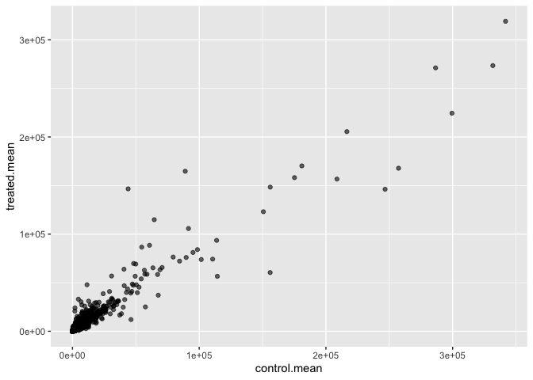
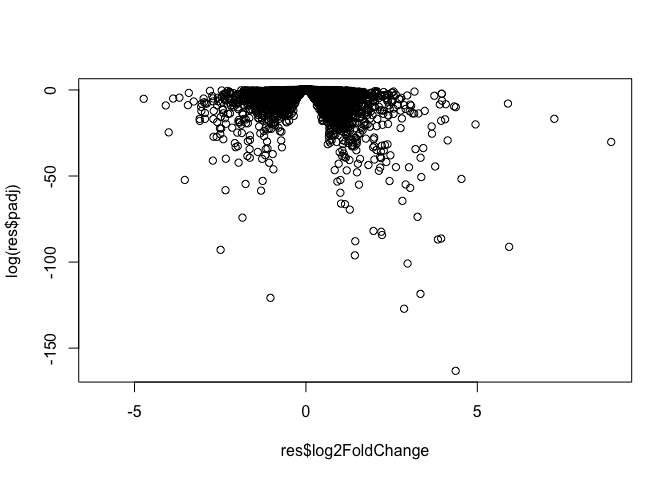
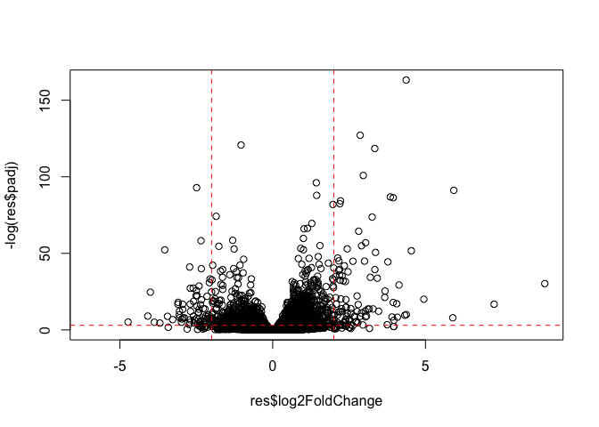
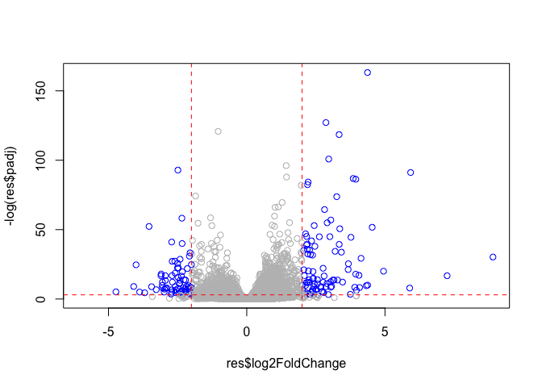
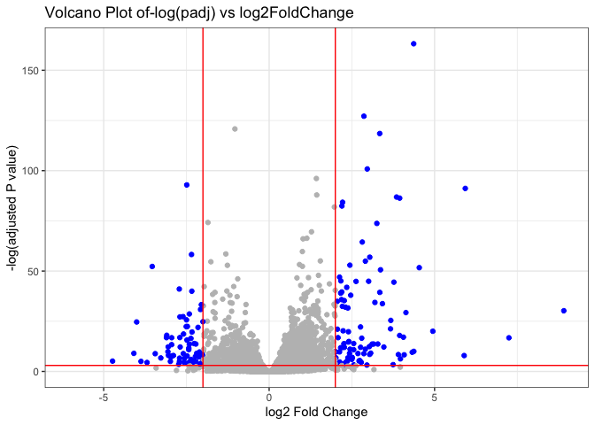

# Class 13: RNASeq Analysis
Leah Kim A16973745

- [Background](#background)
- [Import countData and colData](#import-countdata-and-coldata)
- [Toy Differentialy Gene
  Expression](#toy-differentialy-gene-expression)
- [Setting up for DESeq](#setting-up-for-deseq)
- [Result figure: Volcano Plot](#result-figure-volcano-plot)
  - [We need to add gene annotation](#we-need-to-add-gene-annotation)
- [Pathway Analysis](#pathway-analysis)

# Background

Today we will analyze some RNA sequencing data on the effects of a
common steroid drug on airway cell lines.

THere are two main imputs we need for their analysis:

- countData: counts for genes in rows with experiments in the columns
- colData: or metadata

# Import countData and colData

``` r
counts <- read.csv("airway_scaledcounts.csv",  row.names=1)
metadata <- read.csv("airway_metadata.csv")
```

> Q1. How many genes are in this dataset?

``` r
nrow(counts)
```

    [1] 38694

> Q2. How many ‘control’ cell lines do we have?

``` r
sum(metadata$dex == "control")
```

    [1] 4

# Toy Differentialy Gene Expression

Let’s try finding the average or mean of the “control” and “treated”
columns and see if they differ.

- First we need to find all “control” columns
- Extract just the “control” values for each gene
- Calculate the `mean()` for each gene “control” values

``` r
metadata
```

              id     dex celltype     geo_id
    1 SRR1039508 control   N61311 GSM1275862
    2 SRR1039509 treated   N61311 GSM1275863
    3 SRR1039512 control  N052611 GSM1275866
    4 SRR1039513 treated  N052611 GSM1275867
    5 SRR1039516 control  N080611 GSM1275870
    6 SRR1039517 treated  N080611 GSM1275871
    7 SRR1039520 control  N061011 GSM1275874
    8 SRR1039521 treated  N061011 GSM1275875

``` r
all(colnames(counts) == metadata$id)
```

    [1] TRUE

the dex column tells me whether we have “control” or “treated”

``` r
control.inds <- metadata$dex == "control"
```

Extract just the “control” values for all genes

``` r
control.counts <- counts[,control.inds]
```

Calculate the mean value for each gene in these control columns

``` r
control.mean <- rowMeans( control.counts ) 
head(control.mean)
```

    ENSG00000000003 ENSG00000000005 ENSG00000000419 ENSG00000000457 ENSG00000000460 
             900.75            0.00          520.50          339.75           97.25 
    ENSG00000000938 
               0.75 

> Q3. Do the same for the “treated” values to get a `treated.mean`

``` r
treated.inds <- metadata$dex == "treated"
treated.counts <- counts[,treated.inds]
treated.mean <- rowMeans( treated.counts ) 
head(treated.mean)
```

    ENSG00000000003 ENSG00000000005 ENSG00000000419 ENSG00000000457 ENSG00000000460 
             658.00            0.00          546.00          316.50           78.75 
    ENSG00000000938 
               0.00 

> Q4. Make a plot of `control.mean` vs `treated.mean`

Lets store our mean values together in a data.frame for easier
book-keeping.

``` r
meancounts <- data.frame(control.mean, treated.mean)
head(meancounts)
```

                    control.mean treated.mean
    ENSG00000000003       900.75       658.00
    ENSG00000000005         0.00         0.00
    ENSG00000000419       520.50       546.00
    ENSG00000000457       339.75       316.50
    ENSG00000000460        97.25        78.75
    ENSG00000000938         0.75         0.00

``` r
library(ggplot2)
ggplot(meancounts) +
  aes(control.mean, treated.mean) +
  geom_point(alpha=.6)
```


We totally need to log transform this data as it is heavily skewed!

``` r
plot(meancounts, log="xy")
```

    Warning in xy.coords(x, y, xlabel, ylabel, log): 15032 x values <= 0 omitted
    from logarithmic plot

    Warning in xy.coords(x, y, xlabel, ylabel, log): 15281 y values <= 0 omitted
    from logarithmic plot


Amount is the same

``` r
log(20/20)
```

    [1] 0

Doubling the amount

``` r
log(40/20)
```

    [1] 0.6931472

Halving the amount

``` r
log(10/20)
```

    [1] -0.6931472

A common rule of thumb is to focus on genes with a log2 “fold change” of
+2 as so called UP REGULATED and -2 as DOWN REGULATED.

``` r
log2(80/20)
```

    [1] 2

Lets add a log2 fold change value to our `meancounts` dataframe.

``` r
meancounts$log2fc <-log2(meancounts$treated.mean/meancounts$control.mean)
head(meancounts)
```

                    control.mean treated.mean      log2fc
    ENSG00000000003       900.75       658.00 -0.45303916
    ENSG00000000005         0.00         0.00         NaN
    ENSG00000000419       520.50       546.00  0.06900279
    ENSG00000000457       339.75       316.50 -0.10226805
    ENSG00000000460        97.25        78.75 -0.30441833
    ENSG00000000938         0.75         0.00        -Inf

> Q. Remove any “zero count” genes from the dataset for further analysis

``` r
to.keep <- rowSums(meancounts[,1:2] == 0) == 0
sum(to.keep)
```

    [1] 21817

``` r
mycounts <- meancounts[to.keep,]
head(mycounts)
```

                    control.mean treated.mean      log2fc
    ENSG00000000003       900.75       658.00 -0.45303916
    ENSG00000000419       520.50       546.00  0.06900279
    ENSG00000000457       339.75       316.50 -0.10226805
    ENSG00000000460        97.25        78.75 -0.30441833
    ENSG00000000971      5219.00      6687.50  0.35769358
    ENSG00000001036      2327.00      1785.75 -0.38194109

> Q. How many genes are “up” regulated a a log2fc threshold of +2?

``` r
sum(mycounts$log2fc >= 2)
```

    [1] 314

> Q. How many genes are “down” regulated a a log2fc threshold of -2?

``` r
sum(mycounts$log2fc <= -2)
```

    [1] 485

However, there are some stats missing from this analysis, such as how
significant these changes are and/or whether differences between the
control and treated may have other causes.

``` r
ggplot(mycounts) +
  aes(control.mean, treated.mean) +
  geom_point(alpha=.6)
```



# Setting up for DESeq

We will use DESeq2 to do this:

``` r
library(DESeq2)
```

The first function we will use from this package sets up the input in
the particular format that SESeq wants.

``` r
dds <- DESeqDataSetFromMatrix(countData = counts, 
                              colData = metadata, 
                              design = ~dex)
```

    converting counts to integer mode

    Warning in DESeqDataSet(se, design = design, ignoreRank): some variables in
    design formula are characters, converting to factors

We can now run our DESeq analysis

``` r
dds <- DESeq(dds)
```

    estimating size factors

    estimating dispersions

    gene-wise dispersion estimates

    mean-dispersion relationship

    final dispersion estimates

    fitting model and testing

``` r
res <- results(dds)
```

Peek at results

``` r
head(res)
```

    log2 fold change (MLE): dex treated vs control 
    Wald test p-value: dex treated vs control 
    DataFrame with 6 rows and 6 columns
                      baseMean log2FoldChange     lfcSE      stat    pvalue
                     <numeric>      <numeric> <numeric> <numeric> <numeric>
    ENSG00000000003 747.194195     -0.3507030  0.168246 -2.084470 0.0371175
    ENSG00000000005   0.000000             NA        NA        NA        NA
    ENSG00000000419 520.134160      0.2061078  0.101059  2.039475 0.0414026
    ENSG00000000457 322.664844      0.0245269  0.145145  0.168982 0.8658106
    ENSG00000000460  87.682625     -0.1471420  0.257007 -0.572521 0.5669691
    ENSG00000000938   0.319167     -1.7322890  3.493601 -0.495846 0.6200029
                         padj
                    <numeric>
    ENSG00000000003  0.163035
    ENSG00000000005        NA
    ENSG00000000419  0.176032
    ENSG00000000457  0.961694
    ENSG00000000460  0.815849
    ENSG00000000938        NA

# Result figure: Volcano Plot

plot of the P valuevs the Log2FC

``` r
plot(res$log2FoldChange, res$padj)
```


This P-value is again heavily skewed so lets log transform it.

``` r
plot(res$log2FoldChange, log(res$padj))
```



We can flip the y-axis by ading a minus sign. This will make it easier
to interpret.

``` r
plot(res$log2FoldChange, -log(res$padj))
# Add some cut-off lines
abline(v=c(-2,2), col="red", lty=2)
abline(h=-log(0.05), col="red", lty=2)
```



``` r
mycols <- rep("grey", (nrow(res)))
mycols[ abs(res$log2FoldChange) >= 2 ]  <- "blue" 
mycols[ res$padj > 0.05 ]  <- "grey" 
plot(res$log2FoldChange, -log(res$padj), col=mycols)

abline(v=c(-2,2), col="red", lty=2)
abline(h=-log(0.05), col="red", lty=2)
```



> Q. Make a ggplot volcano plot with colors and lines as annotation
> along with nice axis labels.

``` r
ggplot(as.data.frame(res)) + 
  aes(x = log2FoldChange, y = -log(padj)) +
  geom_point(col = mycols) +
  labs(title = "Volcano Plot of-log(padj) vs log2FoldChange", 
       x = "log2 Fold Change", 
       y = "-log(adjusted P value)") +
  geom_vline(xintercept = c(-2, 2), color = "red") +
  geom_hline(yintercept = -log(0.05), color = "red") +
  theme_bw()
```

    Warning: Removed 23549 rows containing missing values or values outside the scale range
    (`geom_point()`).



## We need to add gene annotation

Gene symbols and different database IDs

# Pathway Analysis

Find what biological psthways my differentially expressed genes
participate in.

We first need to add gene symbols (e.g. HBB, etc. ) so we know what
genes we are dealing with. We need to “translate” between ENSEMBLE ids
that we have in the rownames of `res`.

``` r
head(rownames(res))
```

    [1] "ENSG00000000003" "ENSG00000000005" "ENSG00000000419" "ENSG00000000457"
    [5] "ENSG00000000460" "ENSG00000000938"

``` r
#Install from bioconducter with `BiocManager::install("")`
library(AnnotationDbi)
library(org.Hs.eg.db)
```

``` r
columns(org.Hs.eg.db)
```

     [1] "ACCNUM"       "ALIAS"        "ENSEMBL"      "ENSEMBLPROT"  "ENSEMBLTRANS"
     [6] "ENTREZID"     "ENZYME"       "EVIDENCE"     "EVIDENCEALL"  "GENENAME"    
    [11] "GENETYPE"     "GO"           "GOALL"        "IPI"          "MAP"         
    [16] "OMIM"         "ONTOLOGY"     "ONTOLOGYALL"  "PATH"         "PFAM"        
    [21] "PMID"         "PROSITE"      "REFSEQ"       "SYMBOL"       "UCSCKG"      
    [26] "UNIPROT"     

``` r
res$symbol <- mapIds(org.Hs.eg.db,
                     keys=row.names(res), # Our genenames
                     keytype="ENSEMBL",        # The format of our genenames
                     column="SYMBOL",          # The new format we want to add
                     multiVals="first")
```

    'select()' returned 1:many mapping between keys and columns

``` r
res$genename <- mapIds(org.Hs.eg.db,
                     keys=row.names(res),
                     keytype="ENSEMBL",        
                     column = "GENENAME")
```

    'select()' returned 1:many mapping between keys and columns

``` r
res$uniprot <- mapIds(org.Hs.eg.db,
                     keys=row.names(res),
                     keytype="ENSEMBL",        
                     column = "UNIPROT")
```

    'select()' returned 1:many mapping between keys and columns

``` r
res$entrez <- mapIds(org.Hs.eg.db,
                     keys=row.names(res),
                     keytype="ENSEMBL",        
                     column = "ENTREZID")
```

    'select()' returned 1:many mapping between keys and columns

Be sure to save our annotated results to a file.

``` r
write.csv(res,file="my_annotated_results.csv")
```

``` r
library(gage)
library(gageData)
library(pathview)
```

``` r
data(kegg.sets.hs)

# Examine the first 2 pathways in this kegg set for humans
head(kegg.sets.hs, 2)
```

    $`hsa00232 Caffeine metabolism`
    [1] "10"   "1544" "1548" "1549" "1553" "7498" "9"   

    $`hsa00983 Drug metabolism - other enzymes`
     [1] "10"     "1066"   "10720"  "10941"  "151531" "1548"   "1549"   "1551"  
     [9] "1553"   "1576"   "1577"   "1806"   "1807"   "1890"   "221223" "2990"  
    [17] "3251"   "3614"   "3615"   "3704"   "51733"  "54490"  "54575"  "54576" 
    [25] "54577"  "54578"  "54579"  "54600"  "54657"  "54658"  "54659"  "54963" 
    [33] "574537" "64816"  "7083"   "7084"   "7172"   "7363"   "7364"   "7365"  
    [41] "7366"   "7367"   "7371"   "7372"   "7378"   "7498"   "79799"  "83549" 
    [49] "8824"   "8833"   "9"      "978"   

To run pathway analysis, we will use the `gage()` function and it
requires a wee “vector of importance”. We will use our Log2FC results
from our `res` object.

``` r
foldchanges = res$log2FoldChange
names(foldchanges) = res$entrez
head(foldchanges)
```

           7105       64102        8813       57147       55732        2268 
    -0.35070302          NA  0.20610777  0.02452695 -0.14714205 -1.73228897 

``` r
# Get the results
keggres = gage(foldchanges, gsets=kegg.sets.hs)
```

What is in the returned `keggres` object?

``` r
attributes(keggres)
```

    $names
    [1] "greater" "less"    "stats"  

``` r
# Look at the first three down (less) pathways
head(keggres$less, 3)
```

                                          p.geomean stat.mean        p.val
    hsa05332 Graft-versus-host disease 0.0004250461 -3.473346 0.0004250461
    hsa04940 Type I diabetes mellitus  0.0017820293 -3.002352 0.0017820293
    hsa05310 Asthma                    0.0020045888 -3.009050 0.0020045888
                                            q.val set.size         exp1
    hsa05332 Graft-versus-host disease 0.09053483       40 0.0004250461
    hsa04940 Type I diabetes mellitus  0.14232581       42 0.0017820293
    hsa05310 Asthma                    0.14232581       29 0.0020045888

We can pass our foldchanges vector (our results) together with any of
these highlighted pathway IDS to see how our genes overlap the pathway.

``` r
pathview(gene.data=foldchanges, pathway.id="hsa05310")
```

    'select()' returned 1:1 mapping between keys and columns

    Info: Working in directory /Users/leah/Documents/UCSD/BIMM 143/bimm143_github/class13

    Info: Writing image file hsa05310.pathview.png


