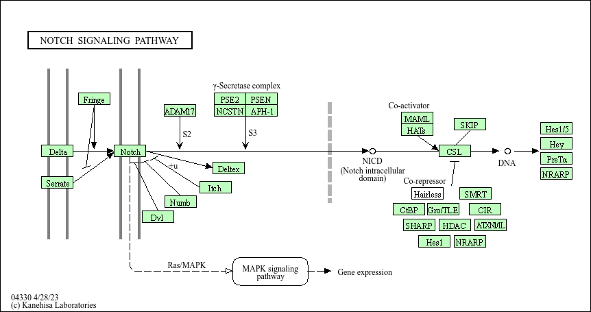
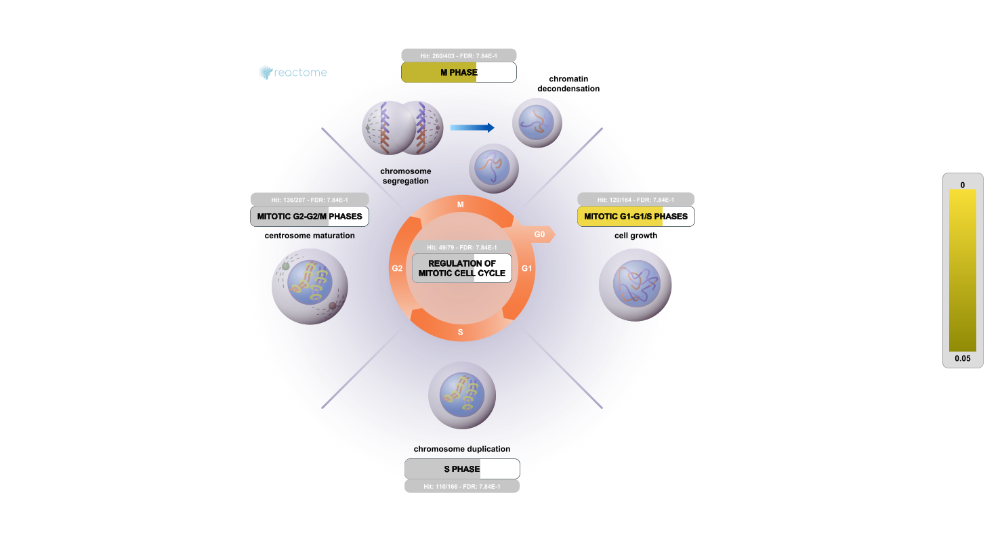

#Data Import
```{r, message = FALSE}
library(DESeq2)
library(AnnotationDbi)
library(org.Hs.eg.db)
library(pathview)
library(gage)
library(gageData)
```

```{r}
metaFile <- "GSE37704_metadata.csv"
countFile <- "GSE37704_featurecounts.csv"

# Import metadata and take a peak
colData = read.csv(metaFile, row.names=1)
head(colData)

# Import countdata
countData = read.csv(countFile, row.names=1)
head(countData)
```
#Tidy counts to match metadata

Check the correspondance of colData rows and countData columns.
```{r}
rownames(colData)
```

Remove the troublesome first column so we match the metadata
```{r}
# Note we need to remove the odd first $length col
counts <- as.matrix(countData[,-1])
```

```{r}
colnames(counts)
```

```{r}
all(colnames(counts) == rownames(colData))
```

# Remove zero count genes

We will have rows in `counts` for genes that we can not say anything about because they have zero expression in the particular tissue we are looking at.

```{r}
head(counts)
```

If the `rowsums()` is zero, then a given gene (i.e. row) has no data adn we should exclude these genes from further consideration.
```{r}
# Filter count data where you have 0 read count across all samples.
to.keep <- rowSums(counts) != 0
cleancounts <- counts[to.keep, ]
```

> Q. How many genes do we have left?

```{r}
nrow(cleancounts)
```

# Setup DESEq analysis

```{r}
dds = DESeqDataSetFromMatrix(countData=cleancounts,
                             colData=colData,
                             design=~condition)
```

# Run DESEq analysis

```{r}
dds = DESeq(dds)
```

# Extract results

```{r}
res <- results(dds)
head(res)
```

# Add Gene anotation

```{r}
columns(org.Hs.eg.db)

res$symbol = mapIds(org.Hs.eg.db,
                    keys=row.names(res), 
                    keytype="ENSEMBL",
                    column="SYMBOL",
                    multiVals="first")

res$entrez = mapIds(org.Hs.eg.db,
                    keys=row.names(res),
                    keytype="ENSEMBL",
                    column="ENTREZID",
                    multiVals="first")

res$name =   mapIds(org.Hs.eg.db,
                    keys=row.names(res),
                    keytype="ENSEMBL",
                    column="GENENAME",
                    multiVals="first")

head(res, 10)
```

# Save my results to a csv file

```{r}
write.csv(res,file="my_annotated_results.csv")
```

# Result Visualization

```{r}
# Make a color vector for all genes
mycols <- rep("gray", nrow(res) )

# Color red the genes with absolute fold change above 2
mycols[ abs(res$log2FoldChange) > 2 ] <- "red"

# Color blue those with adjusted p-value less than 0.01
#  and absolute fold change more than 2
inds <- (res$padj < .01) & (abs(res$log2FoldChange) > 2 )
mycols[ inds ] <- "blue"

plot( res$log2FoldChange, -log(res$padj), col=mycols, xlab="Log2(FoldChange)", ylab="-Log(P-value)" )
```

# Pathway Analysis

```{r}
data(kegg.sets.hs)
data(sigmet.idx.hs)

# Focus on signaling and metabolic pathways only
kegg.sets.hs = kegg.sets.hs[sigmet.idx.hs]

# Examine the first 3 pathways
head(kegg.sets.hs, 3)
```

Use fold changes from DESeq2 analysis to run gage().
```{r}
foldchanges = res$log2FoldChange
names(foldchanges) = res$entrez
head(foldchanges)
```

Run `gage()` pathway analysis
```{r}
# Get the results
keggres = gage(foldchanges, gsets=kegg.sets.hs)
```

Look at object returned
```{r}
attributes(keggres)
```

Use `pathview()` to make a pathway plot
```{r}
pathview(gene.data=foldchanges, pathway.id="hsa04110")
```


```{r}
## Focus on top 5 upregulated pathways here for demo purposes only
keggrespathways <- rownames(keggres$greater)[1:5]

# Extract the 8 character long IDs part of each string
keggresids = substr(keggrespathways, start=1, stop=8)
keggresids
```

```{r}
pathview(gene.data=foldchanges, pathway.id=keggresids, species="hsa")
```

# Reactome Analysis

List significant genes at 0.05 

```{r}
sig_genes <- res[res$padj <= 0.05 & !is.na(res$padj), "symbol"]
print(paste("Total number of significant genes:", length(sig_genes)))
```

```{r}
write.table(sig_genes, file="significant_genes.txt", row.names=FALSE, col.names=FALSE, quote=FALSE)
```

# Go Online analysis
